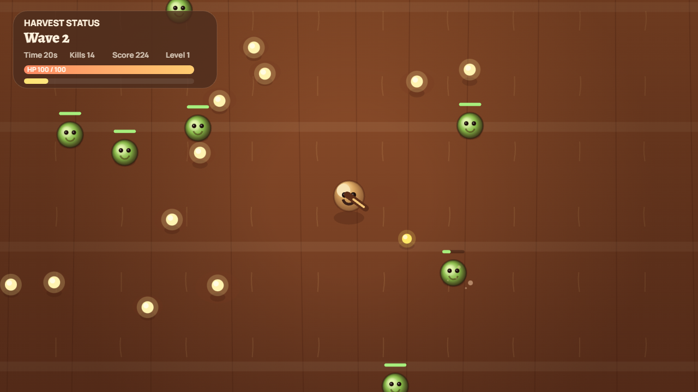
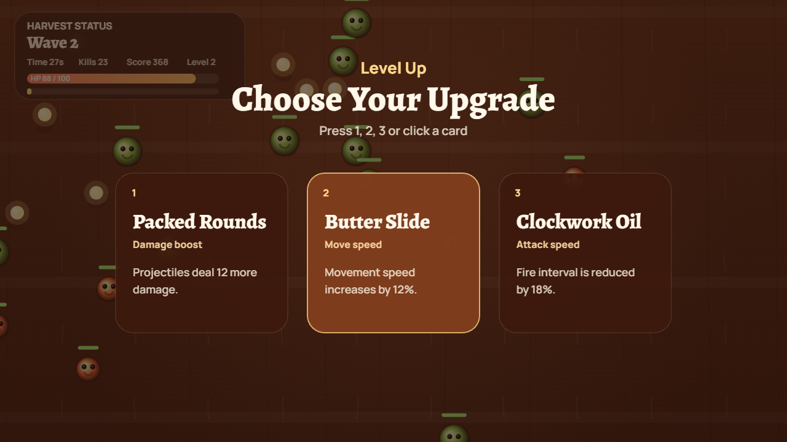

# Spud Arena

> A compact harvest-survival shooter inspired by Brotato, wrapped for browser, desktop, and container play.

Spud Arena drops a battle-hardened potato into a scorched farm ring full of pests, elites, and boss harvest waves. The gun fires on its own. Your job is to stay alive, draft upgrades fast, and keep the field from swallowing the run.



## Why It Feels Good

- Auto-fire combat with movement-first survival pressure
- Fast three-card upgrade drafting
- Boss rounds that spike the tempo every few waves
- Chinese and English UI switching with persistent run settings
- Browser play, Windows desktop packaging, and Docker deployment in one repo

## Screens

### Arena Combat


### Upgrade Draft



## Controls

- `WASD` or arrow keys: move
- Mouse click or `Enter`: start the run
- `1 / 2 / 3`: pick an upgrade
- `F`: toggle fullscreen

## Play In Browser

### Local Dev Server

```powershell
npm run dev
```

Then open:

```text
http://127.0.0.1:4173/index.html
```

### PowerShell Fallback

```powershell
.\run-game.ps1
```

### VSCode

Press `F5` and choose `Open Spud Arena (Edge)` or `Open Spud Arena (Chrome)`.

## Build A Windows EXE

This project includes an Electron desktop wrapper, so you can package the game into a Windows app folder with a direct `.exe` launcher.

### Install Dependencies

```powershell
npm install
```

### Run The Desktop Version In Dev

```powershell
npm run desktop
```

### Build The Desktop EXE

```powershell
npm run build:win
```

The packaged desktop build is written into:

```text
release/
```

Main launcher:

```text
release/Spud Arena-win32-x64/Spud Arena.exe
```

## Run With Docker

### Build The Image

```powershell
docker build -t spud-arena .
```

### Start The Container

```powershell
docker run --rm -p 4173:4173 spud-arena
```

Then open:

```text
http://127.0.0.1:4173
```

### Or With Docker Compose

```powershell
docker compose up --build
```

## Project Layout

- `index.html`: page shell and layout structure
- `styles.css`: outer presentation and responsive framing
- `game.js`: gameplay loop, rendering, upgrades, waves, and UI logic
- `serve.py`: local static server with a direct browser URL
- `desktop/main.js`: Electron entry for desktop packaging
- `Dockerfile`: static container image for deployment
- `docker-compose.yml`: one-command local container launch

## Notes

- No frontend build step is required for browser play.
- The in-page quick-start block has been removed to keep the play screen cleaner; launch instructions now live here in the README.
- Test hooks are available through `window.render_game_to_text()` and `window.advanceTime(ms)` for deterministic browser checks.
